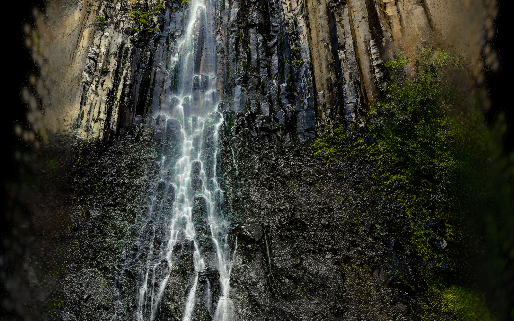
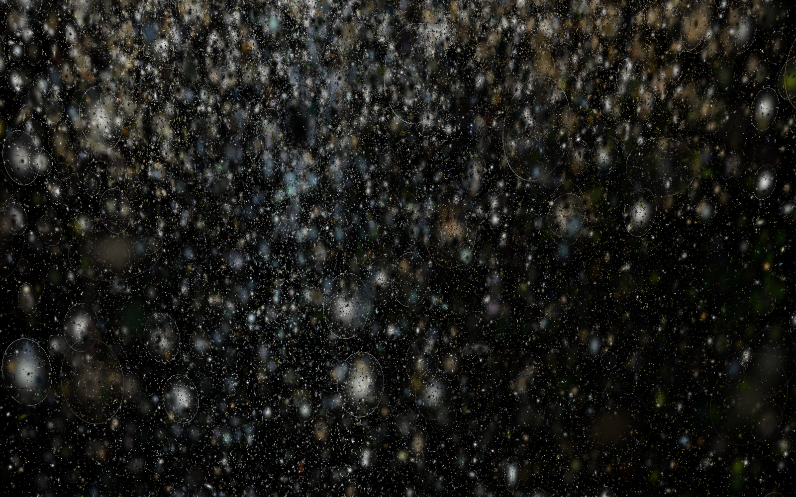
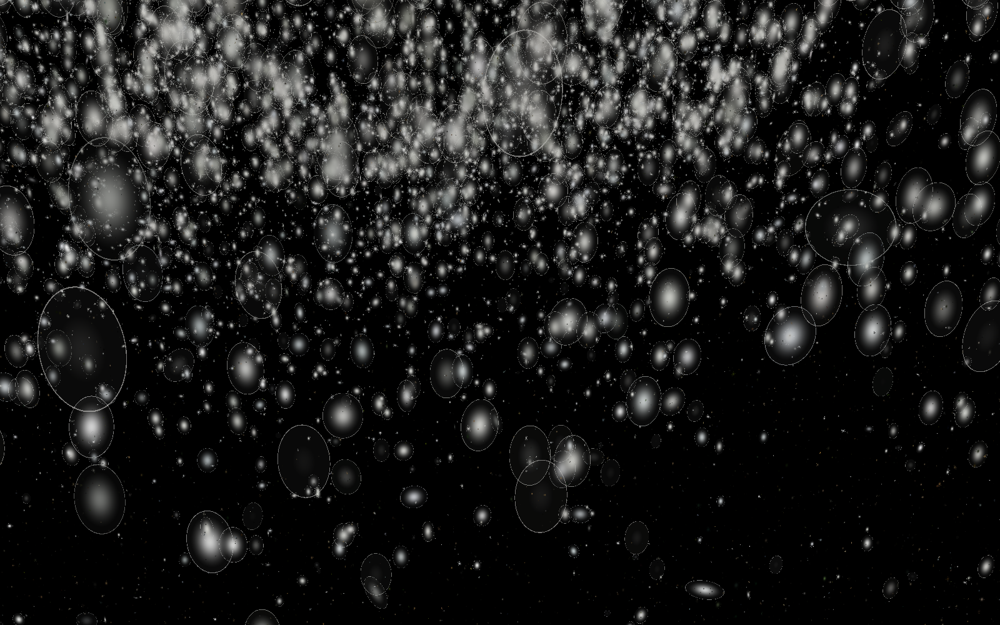

# Terrain as Instrument

A room-scale installation where five places along the route of Robert M. Pirsig's *Zen and the Art of Motorcycle Maintenance* become Gaussian splat terrains projected onto hanging fabric. An overhead depth camera tracks the visitor: the closer you walk, the more the terrain comes apart, while the same tracking data drives a live Max/MSP sound score.

MS thesis, Integrated Design & Media, NYU Tandon School of Engineering, 2026.
Moira (Fan) Zhang · [moirazhang.com](https://moirazhang.com)

| 3 m away | halfway | 0.5 m away |
|---|---|---|
|  |  |  |

---

## System

```
Orbbec Gemini 2 (overhead, tilted)
   │  depth stream, OrbbecSDK v2
   ▼
tools/orbbec/orbbec_syphon_depth        runs as root (macOS needs root for the USB depth device)
   │  OSC /person/count /person/distance /person/x /person/y /person/tooClose   → UDP :7000
   ▼
osc-bridge.mjs (Node)
   ├─► person-distance.json  (atomic write, ~30 Hz)  ──► browser polls every 33 ms
   │                                                      editor-src/src/gesture-controller.ts
   │                                                      distance → dissolve progress, x → camera pan
   ├─► OSC /person/*  → UDP :8000 ──► Max/MSP sound patch
   └─◄ Arduino Nano 33 IoT, 5 buttons, USB serial "BTN1".."BTN5"
         ├─► OSC /scene N → Max/MSP
         └─► scene-state.json ──► browser switches terrain (editor-src/src/scene-controller.ts)
```

Everything runs on one MacBook Pro over localhost. The browser runs fullscreen into a short-throw projector aimed at two hanging layers of organza.

## What's in here

| Path | What it is |
|---|---|
| `tools/orbbec/orbbec_syphon_depth.mm` | Depth-only person detector. Background calibration, foreground threshold, 4-connected blob detection, cross-frame tracking of the closest blob, tilt compensation. Sends OSC. |
| `osc-bridge.mjs` | Receives tracking OSC, writes JSON for the browser, forwards to Max, reads the button console over serial. Hand-rolled OSC encode/decode, no OSC library. |
| `start.sh` | One-command launcher: bridge, web server, browser, depth binary. All detection parameters are env-overridable at the venue. |
| `editor-src/` | Fork of PlayCanvas [SuperSplat](https://github.com/playcanvas/supersplat) (MIT), stripped of its editor UI and turned into a single-purpose renderer. See "Changes to SuperSplat" below. |
| `index.html` | Gallery page that loads each terrain into the renderer with its saved camera. |
| `capture-dissolve.mjs` | Puppeteer script that renders a terrain at dissolve progress 0 / 0.5 / 1 (used for the images above). |

## Problems worth knowing about

**Tracking in the dark.** The first version used MediaPipe pose estimation on the RGB feed. A projection space has to be close to dark, and the visitor is lit mostly by the projection itself, so landmarks kept dropping out. Depth sensing does not care about light, clothing or body shape, so detection moved to the depth stream entirely.

**Orbbec on macOS.** The Astra+ needs OrbbecSDK v1, which has no macOS build. The Gemini 2 works with SDK v2, but TouchDesigner's built-in Orbbec TOP only speaks v1, and macOS requires root to open the USB depth device, which a normally launched GUI app cannot get. The detector therefore runs as its own root process launched from `start.sh`, and everything downstream talks to it over OSC.

**Writing my own detector.** The SDK's `orbbec_syphon` sample does person detection with Apple Vision on the colour stream, which brings the lighting problem back. `orbbec_syphon_depth.mm` replaces it while keeping the same OSC wire format, so the bridge did not need to change:

- 90-frame background calibration stores per-pixel max depth; anything more than `FG_DELTA_MM` in front of it is foreground.
- 4-connected flood fill finds blobs; blobs under `MIN_BLOB_PX` are dropped.
- The camera hangs at about 1.83 m tilted 32°, so raw depth Z is converted to horizontal floor distance, `D = (Z - (H - 0.9 m)·sin θ) / cos θ`, so the rest of the system can keep thinking in "0.5 m to 3 m from the console".
- The closest blob must persist `PERSON_ENTER_FRAMES` frames before it is reported, and survives `PERSON_EXIT_FRAMES` missed frames, which stopped the terrain twitching when a fast-moving body briefly shrank below the size filter.
- A visitor standing directly under the camera has no valid centroid distance; `/person/tooClose` flags that case so the browser holds the fully dissolved state instead of snapping back to calm.
- An optional ignore rectangle (`IGNORE_X0..Y1`) masks out fixtures in the room.

**Torn JSON reads.** The browser fetches `person-distance.json` about 30 times a second from a static server. Writing the file in place occasionally let the server stat it between truncate and write, and the browser aborted with `ERR_CONTENT_LENGTH_MISMATCH`. The bridge now writes to a `.tmp` file and renames it, which is atomic.

**Rendering.** TouchDesigner's Gaussian Splat POP flattened the low-resolution point clouds from the more remote sites and became unstable when I modified how splats moved. SuperSplat in the browser held quality across all sites and let me edit the shader directly.

## Changes to SuperSplat

- `src/shaders/splat-shader.ts`: added a per-splat displacement stage driven by a `progress` uniform. The "noise + dissolve" mode pushes each splat outward along a random direction bent by 3-octave simplex noise, with turbulence that grows with progress, and fades it out.
- `src/particle-effects.ts`, `src/ui/particle-panel.ts`: new. Effect state, easing between target and current progress, and a tuning panel used during development.
- `src/gesture-controller.ts`: new. Polls `person-distance.json` and maps distance linearly to progress, `(3000 - d) / 2500`, so the terrain is calm at 3 m and fully broken up at 0.5 m or closer. Horizontal position pans the camera, smoothed with a small deadband to remove standing-still wobble.
- `src/scene-controller.ts`: new. Switches terrain from `scene-state.json` (button console) or keyboard 1 to 5.
- Editor UI panels removed; the renderer boots straight into a fixed camera per terrain.

## Terrain data

Each site's point cloud was made from satellite imagery using Apple's ml-sharp monocular view synthesis to estimate depth and write PLY, then cleaned per site. The PLY files are about 66 MB each and are not in this repo.

They are available on request; place them in `models/` to run the installation.

Sites: Minneapolis MN, Lemmon SD, Bozeman MT, Klamath Lake OR, Mendocino County CA (plus Red River Valley and Grangeville, used in testing).

## Running it

Requirements: macOS on Apple Silicon, Node 20+, an Orbbec Gemini 2, [OrbbecSDK v2](https://github.com/orbbec/OrbbecSDK_v2) unpacked to `vendor/OrbbecSDK/`.

```bash
npm install
cd editor-src && npm install && npm run build && cd ..   # builds the renderer into editor/
cd tools/orbbec && make && cd ../..                      # builds bin/orbbec_syphon_depth
./start.sh            # asks for your password to run the depth binary as root
```

Without the camera you can still open http://localhost:3000, pick a terrain, and press 1 to 5 to switch sites.

Venue tuning without recompiling, for example:

```bash
CAMERA_HEIGHT_M=2.1 CAMERA_TILT_DEG=40 FG_DELTA_MM=300 MIN_BLOB_PX=800 ./start.sh
```

Button console: an Arduino Nano 33 IoT with five momentary buttons that prints `BTN1` to `BTN5` followed by a newline at 9600 baud. The bridge picks up the first `/dev/tty.usbmodem*` it finds, or set `NANO_SERIAL`.

## Credits

- Sound: the Max/MSP patch and the compositions for each site are by **Siyi Liang** and are not included here. The patch listens on UDP 8000 for `/person/count`, `/person/distance`, `/person/x`, `/person/y` and `/scene`.
- Thesis advisors: Matthew Griffin and Camila A. Morales, NYU Tandon IDM.
- Renderer based on [SuperSplat](https://github.com/playcanvas/supersplat) by PlayCanvas Ltd, MIT licensed; its license is kept at `editor-src/LICENSE`.
- Depth camera access via [OrbbecSDK v2](https://github.com/orbbec/OrbbecSDK_v2).
